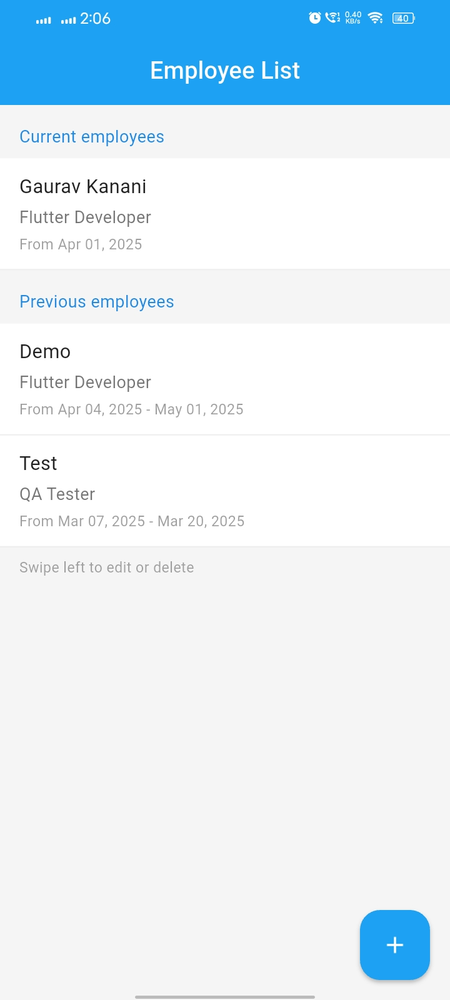
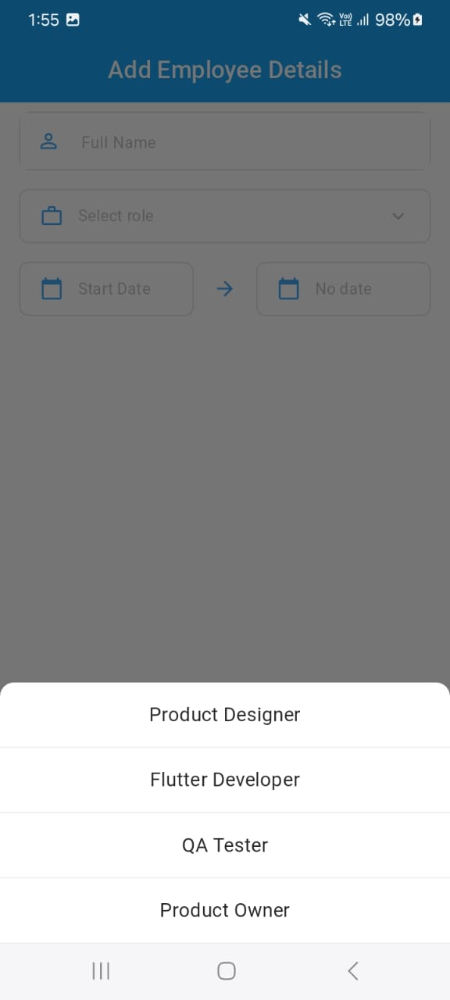
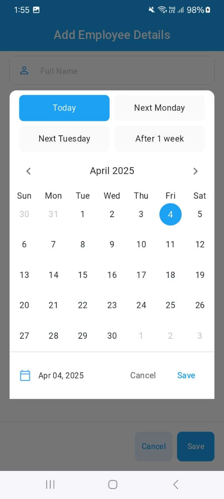
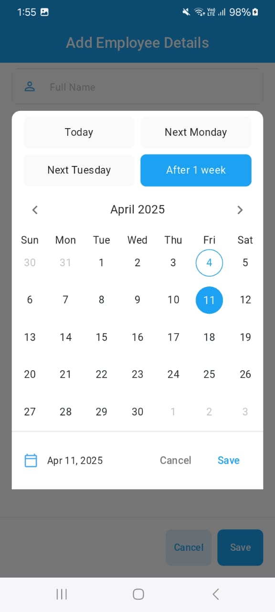
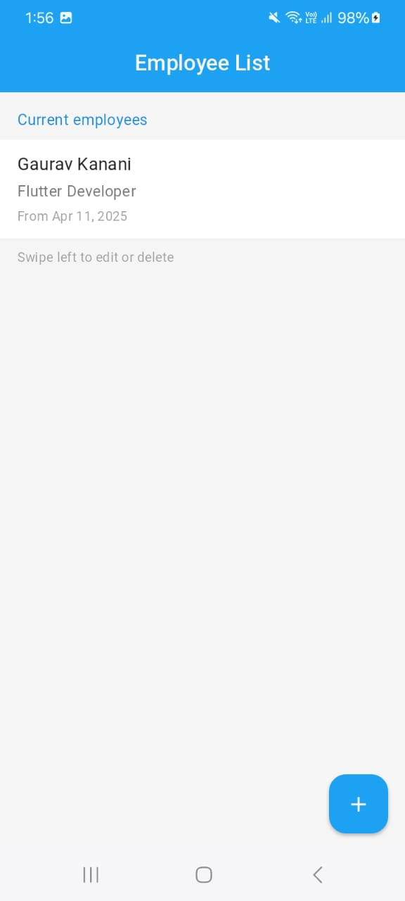

# Employee Management App

## 🚀 Interview Task Project

A modern Flutter application for managing employee records with a beautiful UI and smooth user experience. This project demonstrates proficiency in Flutter development, state management, local storage, and responsive design.

## 🎥 Demo Video

<video width="100%" controls>
  <source src="assets/Screen Recording 2025-04-04 at 12.48.52 AM.mov" type="video/mp4">
  Your browser does not support the video tag.
</video>

## 📱 Screenshots

<div style="display: flex; flex-wrap: wrap; gap: 10px; justify-content: space-between;">
    
    
    
</div>

<div style="display: flex; flex-wrap: wrap; gap: 10px; justify-content: space-between; margin-top: 10px;">
    
    
    
</div>

<div style="display: flex; flex-wrap: wrap; gap: 10px; justify-content: space-between; margin-top: 10px;">
    
</div>

## ✨ Features

- **Splash Screen**: Animated splash screen with network-loaded GIF
- **Employee List**: 
  - Categorized view of current and previous employees
  - Swipeable cards with edit and delete actions
  - Responsive layout for both mobile and web
- **Add/Edit Employee**:
  - Custom date picker with quick selection options
  - Form validation
  - Smooth animations and transitions
- **Modern UI Components**:
  - Custom calendar widget
  - Slidable actions
  - Responsive containers
  - Beautiful color scheme

## 🛠️ Technical Implementation

### Architecture & State Management
- **BLoC Pattern**: Implemented for efficient state management
- **Repository Pattern**: Clean separation of data and business logic
- **Dependency Injection**: Using MultiRepositoryProvider

### Data Persistence
- **Hive Database**: Local storage for employee records
- **Firebase Integration**: Ready for cloud storage implementation

### UI/UX
- **Responsive Design**: Using ScreenUtil for adaptive layouts
- **Custom Widgets**: 
  - DatePicker
  - EmployeeCard
  - ResponsiveWrapper
- **Material Design**: Following latest Material Design guidelines

### Key Components
1. **EmployeeListScreen**
   - Categorized display of employees
   - Swipeable actions
   - Floating action button for adding new employees

2. **AddEditEmployeeScreen**
   - Form validation
   - Custom date picker
   - Responsive layout

3. **CustomDatePicker**
   - Quick date selection buttons
   - Calendar view
   - Flexible date range selection

## 🔧 Technical Stack

- **Framework**: Flutter
- **State Management**: BLoC
- **Database**: Hive
- **Backend Integration**: Firebase
- **Responsive Design**: flutter_screenutil
- **Date Handling**: table_calendar

## 📦 Dependencies

```yaml
dependencies:
  flutter_bloc: ^8.0.0
  hive_flutter: ^1.1.0
  flutter_screenutil: ^5.0.0
  table_calendar: ^3.0.0
  firebase_core: ^2.0.0
```

## 🚀 Getting Started

1. Clone the repository
2. Run `flutter pub get`
3. Ensure you have internet permission in AndroidManifest.xml
4. Run the app using `flutter run`

## 💡 Future Improvements

- Cloud synchronization with Firebase
- Advanced filtering options
- Export functionality
- Dark mode support
- Multi-language support

## 🎯 Interview Task Requirements Met

✅ Modern UI Implementation
✅ Responsive Design
✅ State Management
✅ Local Data Persistence
✅ Custom Widgets
✅ Code Organization
✅ Error Handling
✅ Performance Optimization

## 📝 License

This project is licensed under the MIT License - see the LICENSE file for details.
